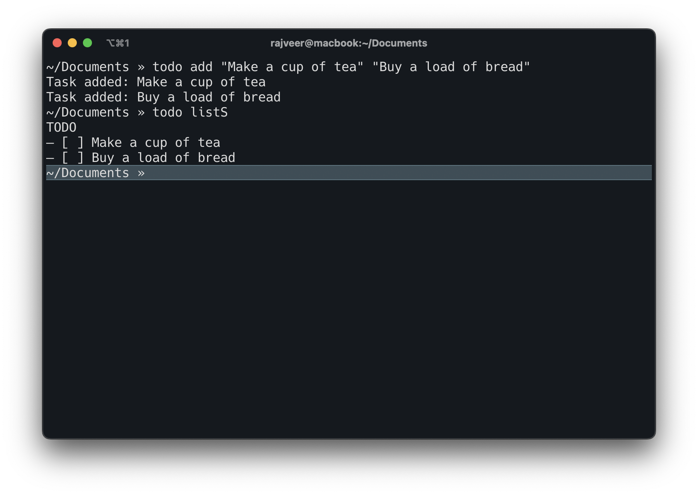

# todo-rs

This is a simple command-line todo application written in Rust using the ZED editor.

## Usage

The application supports the following commands:

- `add`: Adds tasks to the todo list.
- `mark`: Marks a task as completed by specifying its line number.
- `reset`: Clears the todo list.
- `listC`: Lists all tasks with line numbers.
- `listS`: Lists all tasks without date.
- `remove`: Removes a task from the list by specifying its line number.

## How to Use

To use the application, follow these steps:

1. Clone the repository.
2. Navigate to the project directory.
3. Set the path for the todo list file in the `main.rs` file:
   `const FILE_NAME: &str = "<path_to_your_todo_list_file>";`

### Command

`$ cargo run <command> arguments`

### Example

`$ cargo run add "Buy groceries" "Clean the house"`
